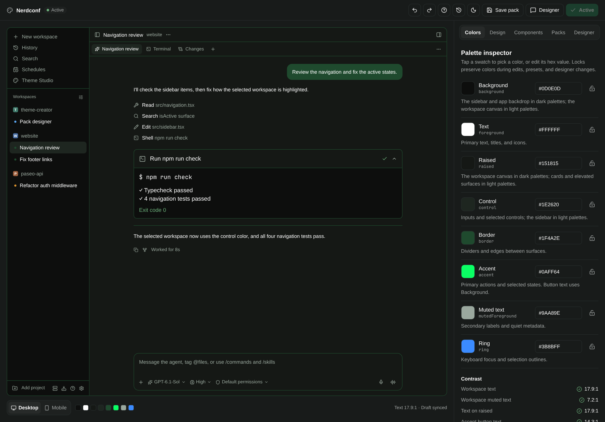
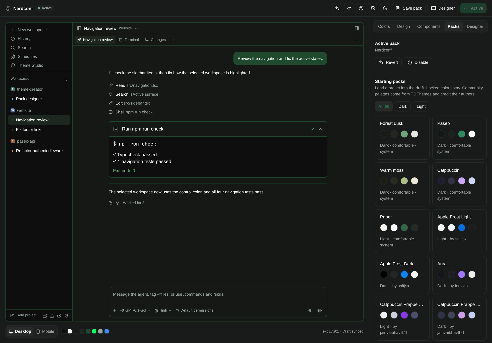
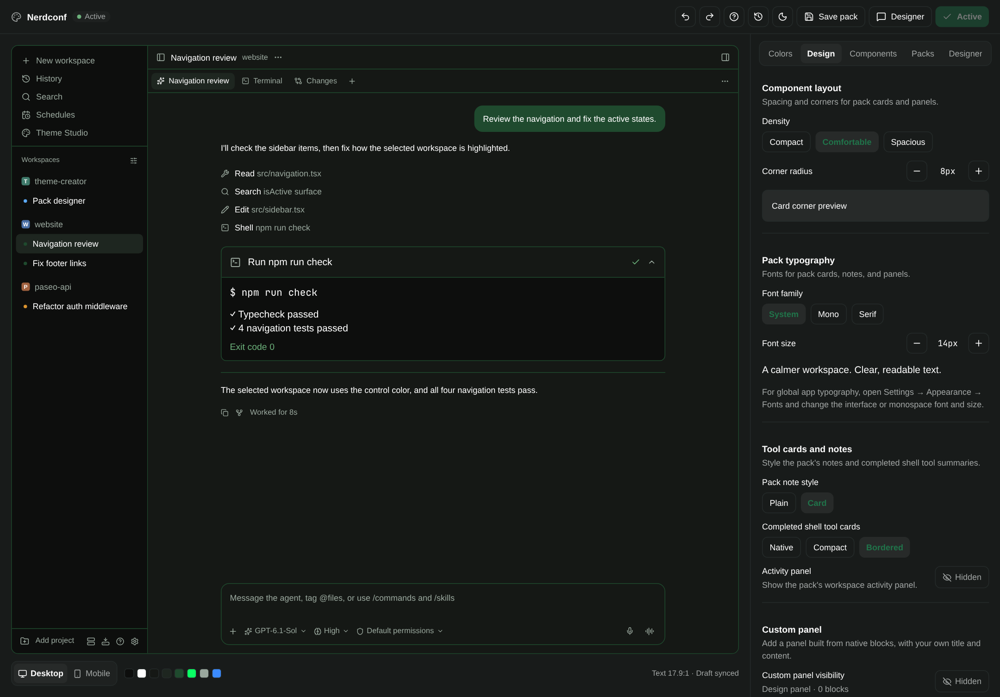
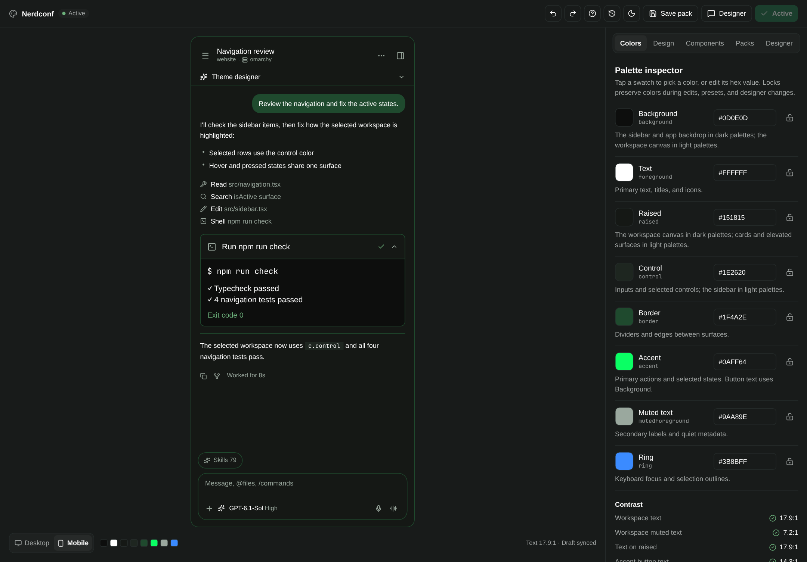
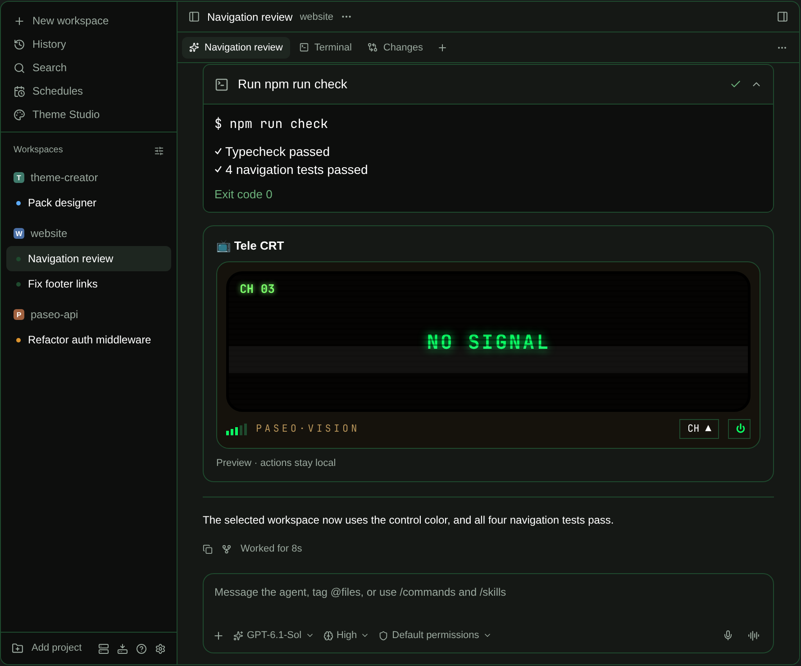

# Paseo Theme Studio

Design how [Paseo](https://paseo.sh) looks without leaving Paseo. Theme Studio is a plugin with a live replica of the app that repaints as you edit, 60 starting palettes, and a designer agent that edits the same draft you do.



## What you get

- **A live preview.** A working replica of Paseo's sidebar, chat, tool rows, terminal, and composer, on desktop and mobile, painted with your draft.
- **60 starting palettes.** Five built in, plus 55 adapted from the community gallery at [T3 Themes](https://t3themes.com), each credited to its author. Filter by light or dark and load one into the draft.
- **Packs, not just colors.** A pack combines the eight appearance colors with density, corner radius, typography, tool-card style, and custom workspace panels.
- **A designer agent.** Ask for "a compact pack with mono text and bordered tool cards" and a real Paseo agent edits the draft through MCP tools. You review and activate.
- **Native chat components.** Agents can publish interactive cards (buttons, inputs, selects, progress) inside their own chat, and react to what you press.
- **Nothing changes until you say so.** Edits go to a draft. Only **Activate** applies it, and **Revert** brings the previous pack back.

| Starting palettes | Pack design | Mobile preview |
| --- | --- | --- |
|  |  |  |

## Install

Requires Paseo `>=0.9.2 <0.11.0` with plugins enabled, and Node.js on the daemon host.

```sh
paseo plugin install https://github.com/Gabsplat/paseo-theme-studio.git
```

Then open **Theme Studio** in the sidebar and choose **Theme Studio · Live** once in **Settings → Appearance**, so the active pack's palette applies across Paseo.

To work on the plugin, or to use code components and pack export (see [Limitations](#limitations)), install it from a checkout instead:

```sh
git clone https://github.com/Gabsplat/paseo-theme-studio.git
cd paseo-theme-studio
pnpm install --frozen-lockfile
paseo plugin install "$PWD"
```

## Quick start

1. Open **Packs** and load a starting palette, or begin from the current draft.
2. In **Colors**, adjust the eight colors. Lock the ones you want to keep; presets, undo, and the designer leave locked colors alone. The contrast summary flags unreadable pairs.
3. In **Design**, pick density, radius, fonts, tool-card style, and workspace panels.
4. Press **Activate**. The status next to the pack name shows whether the draft is live.
5. **Save pack** keeps a named copy in your library. Star it to mark it as a favorite.

To let an agent do it, press **Designer** and describe what you want:

> Make a warm, low-contrast dark pack with serif text and a Notes panel containing a short checklist.

The designer changes the draft only. It cannot activate a pack, unlock a color, or delete anything.

## Components in agent chats



The **Components** inspector holds reusable UI that agents can place in their timeline:

- **Compositions** are validated trees of native blocks: text, stats, lists, progress, buttons, inputs, selects, and toggles. They work as soon as they are saved.
- **Code components** are React Native source that an agent or you write. They run only after you read the source and activate the build.

A component can declare trigger rules such as "after a command fails, show this card", and connected agents publish it on their own when the rule matches. Pressing a button sends the event to the agent that owns the card, and the agent writes the result back into it. Connecting your other agents is opt-in, under **Components → Connect your agents**.

## Export a pack as its own plugin

**Export** writes the current draft as an independent Paseo plugin, with its palette, panels, and tool-card renderers, and shows the command to install it. The exported plugin runs without Theme Studio.

## Limitations

- Code components and pack export typecheck generated source against React Native and the Paseo plugin SDK. Paseo installs plugins without development dependencies, so these two features need the checkout install above. Everything else works from any install.
- Activated code components are written into the plugin's own directory, so a plugin update removes them. Their definitions stay in your library; build and activate them again.
- Code components are trusted code running inside the plugin. The import checks are a filter, not a sandbox, which is why activation requires reviewing the source.
- Packs style the palette, pack-owned components, completed shell tool cards, and workspace panels. Native chat messages, syntax highlighting, terminal ANSI colors, and Paseo's global layout stay under Paseo's control.
- The preview replicates Paseo 0.9.2. Later versions can drift from it visually.
- Tested on Linux daemons with the web and macOS clients. Windows is untested.

## Documentation

- [Reference](docs/reference.md): packs, the designer and its MCP tools, the component library, triggers, revisions, and exports in detail.
- [Development](docs/development.md): project layout, checks, and the end-to-end QA scripts.

```sh
pnpm typecheck
pnpm test
pnpm format:check
```

State lives in `$PASEO_HOME/theme-studio` (by default `~/.paseo/theme-studio`), separate from the plugin's code.

## Credits

- The preview adapts the public visual structure and theme mappings of [Paseo](https://github.com/getpaseo/paseo) at `v0.9.2`. Theme Studio is not an official Paseo product.
- The community palettes are adapted from [T3 Themes](https://t3themes.com) ([source](https://github.com/SunkenInTime/t3-themes)), a gallery of community themes for T3 Code. Each one was reduced to Paseo's eight colors and keeps its author's name, shown in the Packs inspector and recorded in [`shared/community-presets.ts`](shared/community-presets.ts). Thanks to saltjsx, inovvia, jainvaibhav671, emmsixx, timvdhoorn, YanivZalach, itriibouanane, SunkenInTime, kototok903, njpatel, glarivie, D3OXY, pantharshit007, one-om-jha, vertopolkalf, Williawar, chadhs, PunGrumpy, MangMax, vkpdeveloper, and Just-Bax. If you made one of these and want it changed or removed, open an issue.
- Well-known schemes such as Catppuccin, Dracula, Tokyo Night, Solarized, Kanagawa, and Rosé Pine belong to their original projects.

Licensed under [Apache 2.0](LICENSE). See [NOTICE](NOTICE).
